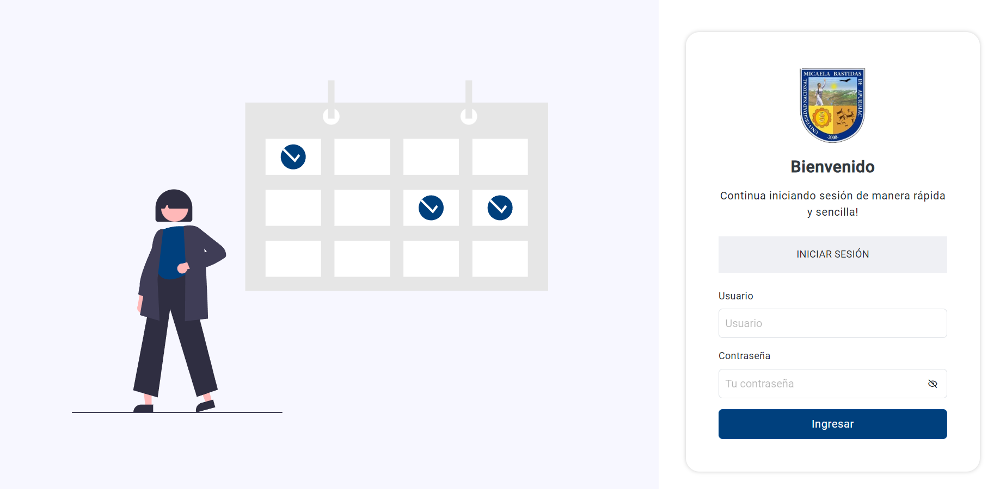

<div align="center">
    <a href="https://github.com/JheysonJhair/app_react_client_gym-dragons">
      
    </a>
    <h1>JhairDev - GYM DRAGONS</h1>
    <p align="center">
        Full Stack Developer Jhair
    </p>
</div>



# Sistema de Gestión de GYM DRAGONS

Bienvenido al **Sistema de Gestión de GYM DRAGONS**, una aplicación frontend diseñada para gestionar todos los aspectos de un gimnasio. Este sistema permite a los administradores gestionar a los miembros, monitorear su progreso, programar clases, y manejar la facturación de membresías, todo de manera eficiente.

## Tecnologías Utilizadas

- **React**: Biblioteca principal utilizada para desarrollar la interfaz de usuario.
- **TypeScript**: Lenguaje utilizado para tipado estático y mejor mantenimiento del código.
- **Bootstrap**: Framework de CSS utilizado para crear una interfaz responsiva y moderna.
- **Vite**: Herramienta de construcción que optimiza el desarrollo y mejora el rendimiento de la aplicación.

---

## Módulos del Sistema

La aplicación incluye los siguientes módulos:

- **Módulo de Miembros**: Gestión de la información de los miembros, incluyendo sus inscripciones, datos personales y progreso físico.
- **Módulo de Clases**: Administración y programación de clases grupales o individuales para los miembros.
- **Módulo de Entrenadores**: Gestión de entrenadores del gimnasio, incluyendo asignación de clases y control de horarios.
- **Módulo de Facturación**: Gestión de los pagos de membresías, emisión de facturas y control de planes de suscripción.
- **Módulo de Reportes**: Genera reportes detallados sobre el rendimiento del gimnasio, estadísticas de membresías, y clases más populares.
- **Módulo de Usuarios**: Administración de usuarios con diferentes roles (administradores, entrenadores, y miembros).

---

## Instalación

1. **Requisitos previos**:
   - Tener instalado **Node.js** y **npm** en tu sistema.
   - Back-end:

    ```bash
    git clone https://github.com/Edsghot/dragons-gym

2. **Clonar el repositorio**:
   ```bash
   git clone https://github.com/JheysonJhair/app_react_client_gym-dragons.git
   cd app_react_client_gym-dragons

    ```

3. **Ejecuta el comando `npm run dev` para iniciar el servidor de desarrollo.**
    
    ```bash
    npm run dev
    ```

4. **Abre tu navegador y visita `http://localhost:5173`.**

¡Listo! Ahora puedes comenzar a trabajar en el Sistema sin problemas.


